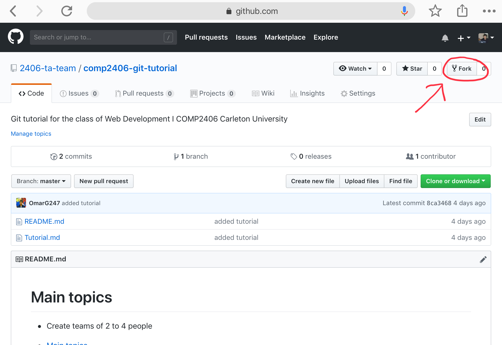
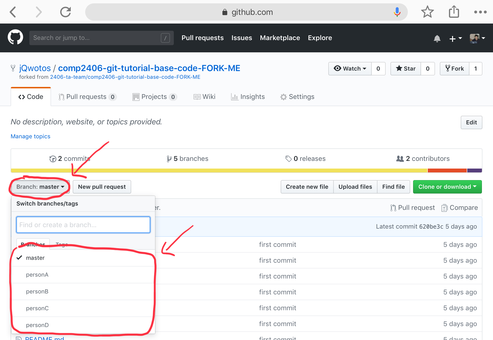

# COMP 2406 - Winter 2019 Going into depth with Git
## Introduction to Git features such as branches, pull requests & merge conflicts.

© L.D. Nel 2019, Omar Garcia Flores & Jason Le

Revisions:

---

- [COMP 2406 - Winter 2019 Going into depth with Git](#comp-2406---winter-2019-going-into-depth-with-git)
  - [Introduction to Git features such as branches, pull requests & merge conflicts.](#introduction-to-git-features-such-as-branches-pull-requests--merge-conflicts)
  - [Description:](#description)
  - [Overview](#overview)
  - [Instructions:](#instructions)
- [Step 1, Fork the given GitHub base code repository into your own repository](#step-1-fork-the-given-github-base-code-repository-into-your-own-repository)
- [Step 2, Add other collaborators (Max 4 people)](#step-2-add-other-collaborators-max-4-people)
- [Step 3, Clone the repository locally](#step-3-clone-the-repository-locally)
- [Step 4, Generate branches (One per team member)](#step-4-generate-branches-one-per-team-member)
- [Step 5, Modify different sections of the Base Code](#step-5-modify-different-sections-of-the-base-code)
  - [Pushing code changes](#pushing-code-changes)
- [Step 6 Merge branches by creating a pull request (One per branch)](#step-6-merge-branches-by-creating-a-pull-request-one-per-branch)
- [Step 7,](#step-7)
- [Step 8, Create a pull request and resolving the merge conflicts](#step-8-create-a-pull-request-and-resolving-the-merge-conflicts)
- [Liveshares](#liveshares)
  - [VSCode Liveshare](#vscode-liveshare)
  - [Atom Liveshare](#atom-liveshare)

---

## Description:

The purpose of this tutorial is for you and a team of at least 1 other student with work with a given Git repository, make some modifications and deal with some of the most common features such as creating a working branch, pull requests and dealing with merge conflicts.

As background for this tutorial it is recommended that you look over the Git documentation in the following website https://guides.github.com/introduction/git-handbook/

To learn more about version control software and Git, refer to the following website: https://git-scm.com/about

Tutorial grading: 0, 1, or 2 marks. 0 marks for no show or no progress. 1 mark for partial completion, and 2 marks for completing all or most of the tutorial. Important: tutorials are meant to be started as homework. You will not generally be able to finish a tutorial if you only start it at the tutorial session.

---

## Overview
In this tutorial you will fork a **Github Repository** and work on the project with other students.

---

## Instructions:

- You will need to form teams of **2 to 4** people.

---

# Step 1, Fork the given GitHub base code repository into your own repository

- Sign into [Github](https://github.com/OmarG247/comp2406-git-tutorial-base-code)
  
- One Person visit https://github.com/2406-ta-team/comp2406-git-tutorial-base-code-FORK-ME and fork the repository by clicking on the fork button



# Step 2, Add other collaborators (Max 4 people)

Head to your projects' settings

Click on the Collaborators tab on the left hand bar and then enter the GitHub usernames of your team members.


# Step 3, Clone the repository locally

Navigate to your GitHub projects folder using your terminal

Get the URL for the forked repository under the green `Clone or Download` button
```sh
git clone [URL]
```
# Step 4, Generate branches (One per team member)
Create seperate for each team member within the folder
Each branch **MUST** have a unique name
```sh
cd comp2406-git-tutorial-base-code
git checkout -b [NAME OF BRANCH]
```

> Maybe add examples of running the commands

Specifying the `-b` flag on the `git checkout` command specifies *git* to create a new branch if it doesn't exist

We can also switch branches by using the following command `git checkout [NAME OF BRANCH]`

# Step 5, Modify different sections of the Base Code 

Each person should **INDIVIDUALLY** modify the `index.jade` file (in the `views` folder) and change the text from
```
Congrats! Now go back to the tutorial
```
to something else (keep it unique, everyone should have different text)

For example, your file should look something like this after
`index.jade`
```jade
extends layout

block content
  h1= title
  p COMP 2406 is the best course!
```

##  Pushing code changes

Note that since we are using different branches, we will need to use a slightly modified command to push

Each person will have to push their code changes to their respective branches using the following commands (replacing `[STUFF]` with the approrpiate text)

```sh
git add -A 
git commit -m "[SOME USEFUL COMIT MESSAGE]"
git push origin [NAME OF BRANCH]
```

> Maybe add examples here of running the command

We need to specify the `origin` location on this push because git will automatically name the *remote* (that exist on *github*) *origin*

Now on Github you should see all of the team members branches under the branch tab.

The TA may request you to show them the branches on Github.



# Step 6 Merge branches by creating a pull request (One per branch)

After having succesfully pushed all the different branches onto GiHub, we will create a pull request per branch.

Each team member must follow the following steps to create a pull request: 
- Select the `Compare & pull request`

# Step 7, 


# Step 8, Create a pull request and resolving the merge conflicts

- Person 1 does:
  - A
- Person 2 does:
  - B
- Person 3 does:
  - C
- Person 4 does:
  - D 

# Liveshares

If you chose to work with a partner during the assignments, you may find it useful to work on it simultaneously. This is where liveshares are handy. They are essentially a google docs for coding

For this tutorial you can chose either to use VSCode liveshare or Atom (YOU DO NOT NEED TO DO BOTH).

- [VSCode Liveshare](#vscode-liveshare)
- [Atom Liveshare](#atom-liveshare)

## VSCode Liveshare
Start by installing VSCode.


## Atom Liveshare