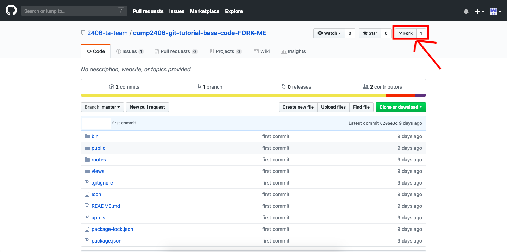
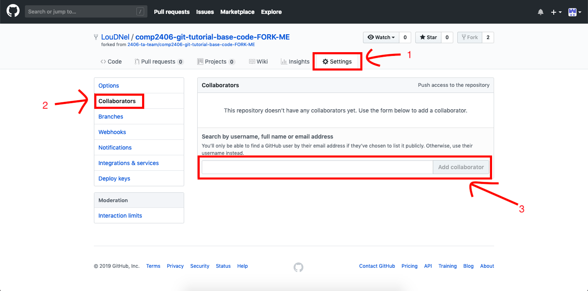
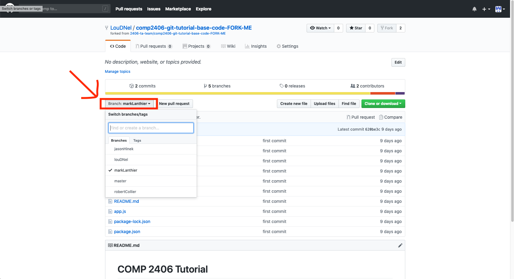
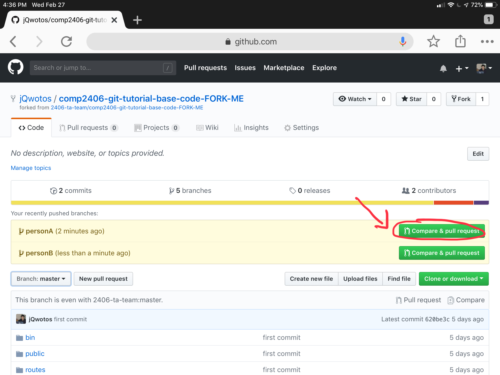

# COMP 2406 - Winter 2019 Going into depth with Git
## Introduction to Git features such as branches, pull requests & merge conflicts.

© Omar Garcia Flores, Jason Le, & L.D. Nel 2019.

Revisions:

---
- [COMP 2406 - Winter 2019 Going into depth with Git](#comp-2406---winter-2019-going-into-depth-with-git)
  - [Introduction to Git features such as branches, pull requests & merge conflicts.](#introduction-to-git-features-such-as-branches-pull-requests--merge-conflicts)
  - [Description](#description)
  - [Overview](#overview)
  - [Instructions](#instructions)
- [Part A - Setup](#part-a---setup)
  - [Step 1, Fork the given GitHub base code repository into your own repository](#step-1-fork-the-given-github-base-code-repository-into-your-own-repository)
  - [Step 2, Add other collaborators (Max 4 people)](#step-2-add-other-collaborators-max-4-people)
  - [Step 3, Clone the repository locally](#step-3-clone-the-repository-locally)
  - [Step 4, Generate branches (One per team member)](#step-4-generate-branches-one-per-team-member)
- [Part B - Creating a Page and Pushing it using a Pull Request](#part-b---creating-a-page-and-pushing-it-using-a-pull-request)
  - [Step 1, Create individual pages](#step-1-create-individual-pages)
  - [Step 2, Pushing code changes](#step-2-pushing-code-changes)
  - [Step 3 Merge branches by creating a pull request (One per branch)](#step-3-merge-branches-by-creating-a-pull-request-one-per-branch)
  - [Note](#note)
- [Part C - Merge Conflicts (modifying `index.jade`)](#part-c---merge-conflicts-modifying-indexjade)
  - [Step 1, Pull the changes from Part B](#step-1-pull-the-changes-from-part-b)
  - [Step 2, make the following changes to the base code depending on the size of your team](#step-2-make-the-following-changes-to-the-base-code-depending-on-the-size-of-your-team)
  - [Step 3, Pushing code changes](#step-3-pushing-code-changes)
  - [Step 4, Create a pull request](#step-4-create-a-pull-request)
  - [Note: **All team members must follow each step, one member at a time.**](#note-all-team-members-must-follow-each-step-one-member-at-a-time)
  - [Step 5, Dealing with Merge Conflicts](#step-5-dealing-with-merge-conflicts)
- [Suggested Exercises](#suggested-exercises)
  - [(Optional) Liveshares](#optional-liveshares)
  - [VSCode Liveshare](#vscode-liveshare)
  - [Atom Teletype](#atom-teletype)

---

## Description

The purpose of this tutorial is for you and a team of at least 1 other student with work with a given Git repository, make some modifications and deal with some of the most common features such as creating a working branch, pull requests and dealing with merge conflicts.

As background for this tutorial it is recommended that you look over the Git documentation in the following website https://guides.github.com/introduction/git-handbook/

To learn more about version control software and Git, refer to the following website: https://git-scm.com/about

Tutorial grading: 0, 1, or 2 marks. 0 marks for no show or no progress. 1 mark for partial completion, and 2 marks for completing all or most of the tutorial. Important: tutorials are meant to be started as homework. You will not generally be able to finish a tutorial if you only start it at the tutorial session.

---

## Overview

In this tutorial you will fork a **Github Repository** and work on the project with other students.

---

## Instructions

- This tutorial will require you to **already** have set up your ssh key with your github account. If you haven't finished such requirement, **you must complete part 2 of Tutorial 6.**

- You will need to form teams of **2 to 4** people.

---

# Part A - Setup
## Step 1, Fork the given GitHub base code repository into your own repository

Sign into [https://github.com](https://github.com)
  
Only one team member must visit https://github.com/2406-ta-team/comp2406-git-tutorial-base-code-FORK-ME and fork the repository by clicking on the fork button



## Step 2, Add other collaborators (Max 4 people)

**Note: only one person needs to add all the collaborators**

Head to your projects' settings

Click on the Collaborators tab on the left hand bar and then enter the GitHub usernames of your team members. Click on 'Add Collaborator' once the correct username is selected.



## Step 3, Clone the repository locally
**Note: Everyone in the team must perform the following steps individually**

Navigate to your GitHub projects folder using your *terminal*

Get the URL for the forked repository under the green `Clone or Download` button

```sh
git clone <URL>
```

## Step 4, Generate branches (One per team member)

Create seperate for branches for each team member within the folder,
ach branch **MUST** have a unique name

```sh
cd comp2406-git-tutorial-base-code
git checkout -b <NAME OF YOUR BRANCH>
```
> *Example*
> ```
> git checkout -b louDNel
> ```

> *Notes*:
> 
> Specifying the `-b` flag on the `git checkout` command specifies *git* to create a new branch if it doesn't exist
> 
> We can also switch branches by using the following command `git checkout [NAME OF YOUR BRANCH]`
> 
> Branches are case sensitive




# Part B - Creating a Page and Pushing it using a Pull Request
## Step 1, Create individual pages

Each tem member must create their own page with the filename `LouDNel.jade` (changing LouDNel to your name) inside of `/views` folder with the following contents (changing `Lou D Nel` with your name)

*Example*
`/views/LouDNel.jade`
```
extends layout

block content
  h1= title
  p Hi! My name is Lou D Nel
```

After creating the pages we must track them and add them to the origin repository by following the next steps.

---

## Step 2, Pushing code changes

Note that since we are using different branches, we will need to use a slightly modified command to push

Each person will have to push their code changes to their respective branches using the following commands (replacing `[SOME USEFUL COMMIT MESSAGE]` with the approrpiate text)

```sh
git add -A 
git commit -m "SOME USEFUL COMMIT MESSAGE"
git push origin <NAME OF YOUR BRANCH>
```

> *Example*
>
> ```
> git add -A
> git commit -m "Added LouDNel's personal Page"
> git push origin louDNel
> ``` 

> *Notes*
> 
> We need to specify the `origin` location on this push because git will automatically name the *remote* (that exist on *github*) *origin*

Now on Github you should see all of the team members branches under the branch tab.

The TA may request you to show them the branches on Github.

---

## Step 3 Merge branches by creating a pull request (One per branch)

After having succesfully pushed all the different branches onto GiHub, we will create a pull request per branch.

Each team member must follow the following steps to create a pull request: 
- Select the `Compare & Pull Request`



- make sure that the `base: master` branch is selected

- Select the `Create Pull Request` to create the pull request

> *Note:*
> 
> A **pull request** is way for someone to submit a code change to a repository. Instead of pushing directly to the `master` branch it's better to create *pull request* so it doesn't affect the main code immediately.

## Note
**DO NOT** delete your branch once your pull request was succesfully merged onto the master branch.

---

# Part C - Merge Conflicts (modifying `index.jade`) 

## Step 1, Pull the changes from Part B

You must now pull all the changes that were made into your current branch by entering the following command:

```ssh
git pull origin <NAME OF YOUR BRANCH>
```

---

## Step 2, make the following changes to the base code depending on the size of your team

One at a time, each person create a pull request from their branch to the `master` branch

Each person should **INDIVIDUALLY** modify the `index.jade` file (in the `views` folder) and change the text from

```
Congrats! Now go back to the tutorial
```

to something else (keep it unique, everyone should have different text)

For example, your file should look something like this after
`index.jade`
```jade
extends layout

block content
  h1= title
  p COMP 2406 is the best course!
```

Each person, one at a time must now add the changes to the repository.

---

## Step 3, Pushing code changes

Note that since we are using different branches, we will need to use a slightly modified command to push

Each person will have to push their code changes to their respective branches using the following commands (replacing `[STUFF]` with the approrpiate text)

```sh
git add -A 
git commit -m "SOME USEFUL COMIT MESSAGE"
git push origin <NAME OF YOUR BRANCH>
```

> *Example*
> 
> ```
> git add -A
> git commit -m "Modified tagline on index.jade"
> git push origin louDNel
> ```

We need to specify the `origin` location on this push because git will automatically name the *remote* (that exist on *github*) *origin*

---

## Step 4, Create a pull request

## Note: **All team members must follow each step, one member at a time.**

Each team member must follow the following steps to create a pull request: 
- Select the `Compare & Pull Request`


> *Note:*
> 
> A **pull request** is way for someone to submit a code change to a repository. Instead of pushing directly to the `master` branch it's better to create *pull request* so it doesn't affect the main code immediately.

---

## Step 5, Dealing with Merge Conflicts 

Back on your terminal, we run the following commands to resolve the merge conflict
```
git fetch origin
git checkout master
git pull
git checkout <BRANCH NAME>
git merge master
```

You will receive the error
```
Auto-merging views/index.jade
CONFLICT (content): Merge conflict in views/index.jade
Automatic merge failed; fix conflicts and then commit the result.
```

and your `index.jade` should now look like
```
extends layout

block content
  h1= title
<<<<<<< HEAD
  p I think Javascript is better than Python
=======
  p Python <3
>>>>>>> master
```

This is a merge conflict, when two people have modified the same file and we need to combine the code together.

To do so, we will mesh both paragraphs together so by removing the
`<<<<<<< HEAD`, `=======` and `>>>>>>> master` which are the indicators for merge conflicts.

At the end of it, your file should look something like this
```
extends layout

block content
  h1= title
  p I think Javascript is better than Python
  p Python <3
```

and now we can push the changes to master


```
git add -A
git commit -m "resolved merge conflicts"
git push origin <BRANCH NAME>

git checkout master
git merge --no-ff <BRANCH NAME> -m "MESSAGE"
git push origin master
```

# Suggested Exercises

## (Optional) Liveshares

If you chose to work with a partner during the assignments, you may find it useful to work on it simultaneously. This is where liveshares are handy. They are essentially a google docs for coding

For this tutorial you can chose either to use VSCode liveshare or Atom Teletype (YOU DO NOT NEED TO DO BOTH).

- [VSCode Liveshare](#vscode-liveshare)
- [Atom Liveshare](#atom-liveshare)

These pluggins will allow you and your teammates to have real time collaboration with your code. Imagine being able to convert your current file into a Google sheets like document in which you can have many people typing at once. 

## VSCode Liveshare
https://marketplace.visualstudio.com/items?itemName=MS-vsliveshare.vsliveshare

## Atom Teletype
https://teletype.atom.io/
